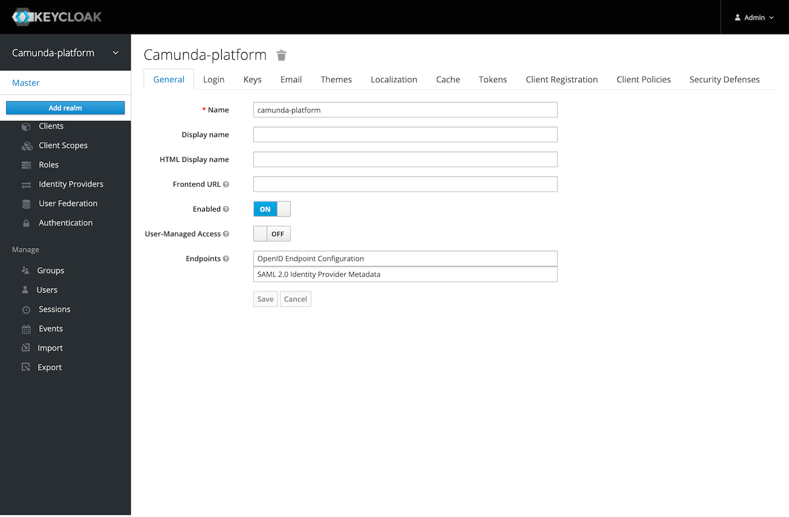
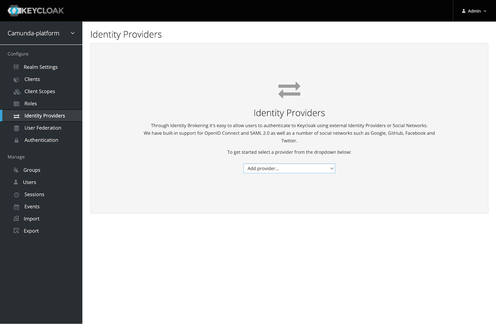
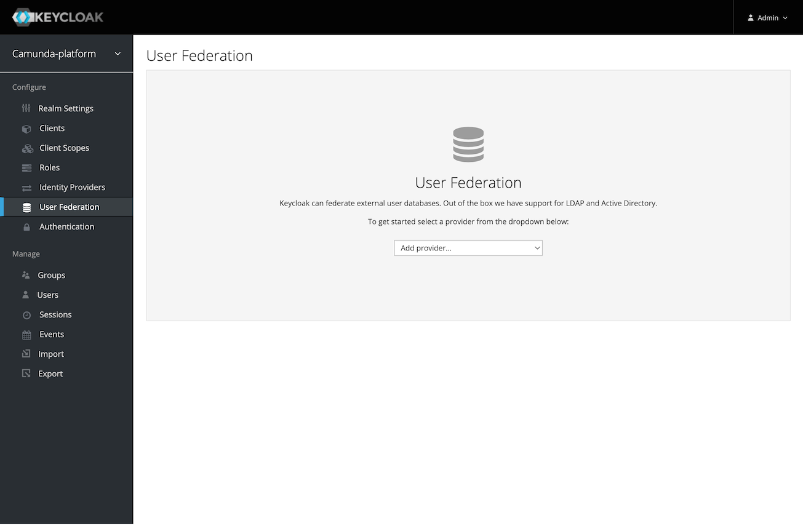

In this guide we will show you how to configure an external identity provider like OpenID Connect, SAML, LDAP or
Active Directory.

:::note
The Identity UI does not offer support for configuring external identity providers. You can configure an external
identity provider directly in Keycloak Administrator Console.
:::

To add an identity provider you need to log in to the Keycloak Administrator Console.

1. Open the URL you have configured for Keycloak in your browser

When using the example
[Docker Compose](https://docs.camunda.io/docs/self-managed/platform-deployment/docker/#docker-compose) setup, Keycloak
is available at [http://localhost:18080/](http://localhost:18080/).

2. Click on `Administrator Console` and log in using the Keycloak administrator credentials

The default administrator username is `admin`.

When operating Camunda Platform 8 on Kubernetes using [helm charts](/self-managed/platform-deployment/kubernetes-helm/),
you can extract the password as described on
[Secrets extraction](/self-managed/platform-deployment/kubernetes-helm/#secrets-extraction).
Using the example [Docker Compose](https://docs.camunda.io/docs/self-managed/platform-deployment/docker/#docker-compose)
setup, the password is set via `KEYCLOAK_ADMIN_PASSWORD` environment variable and is `admin` per default.

3. Select the realm you are using with Camunda Platform 8. Per default it is **Camunda-platform**.

4. Add an identity provider

To add an OpenID Connect or SAML provider, select `Identity Providers` in the main menu, click on `Add provider...`
and fill in all required configuration settings.

To connect to your LDAP, Active Directory or Kerberos server, select `User Federation` in the main menu, click on
`Add provider...` and fill in all required configuration settings.

:::tip
Keycloak supports a wide variety of authentication options, such as mapping external user groups, roles or scopes to
internal roles or configuring the login screen and flow when multiple providers are added. For full reference we
recommend taking a look at Keycloak documentation for
[Adding a provider](https://www.keycloak.org/docs/16.1/server_admin/index.html#adding-a-provider),
[Configuring authentication](https://www.keycloak.org/docs/16.1/server_admin/index.html#configuring-authentication) or
[Integrating identity providers](https://www.keycloak.org/docs/16.1/server_admin/index.html#_identity_broker)
:::
